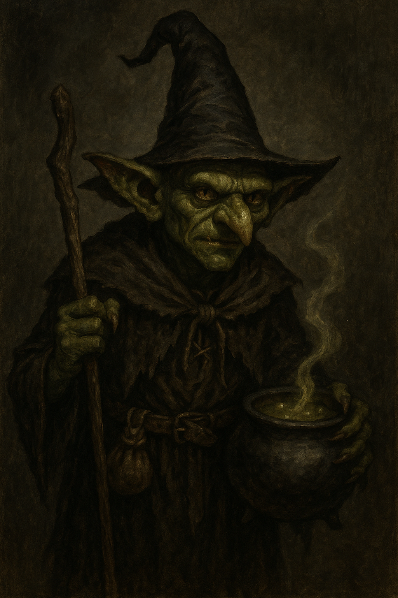

<section class="campaign-hero">

A Shadowdark Campaign Archive

<h2>Hooded Lantern Cartel</h2>

The Hooded Lantern Cartel has used Helix as its base while exploring the Barrow Mounds, recovering strange grave goods and following signs of organized activity among the tombs. The Steel Bone Brotherhood remains a persistent pressure:…

</section>

## Campaign Now

[Read the full Previously On and current campaign state →](campaign-now/)

## The Party

<a class="party-card internal" href="./party/pc-sab"><strong>Sab</strong><small>Sab is the party's halfling priest: an Old Gods devotee, healer, anti-undead specialist, and frequent voice of caution. Her divine magic, crossbow, and halfling invisibility let her move between support, scouting, and precise violence.</small></a>
<a class="party-card internal" href="./party/pc-oogie"><strong>Oogie</strong><small>Oogie is a fungal seer whose trances, omens, and unusual perspective make him the party's occult support and intuitive investigator. His mycelial nature became materially important when the Fair Church restored him in its cemetery compost…</small></a>
<a class="party-card internal" href="./party/pc-orlin"><strong>Orlin</strong><small>Orlin is a shapechanging adventurer whose bear-form strength, healing, bow work, and alertness make him a flexible explorer. The table has described him as a beastmaster-in-training; a more exact class label has not been established in the…</small></a>
<a class="party-card internal" href="./party/pc-grond"><strong>Grond</strong><small>Grond is a kobold pit fighter and the party's most direct front-line bruiser. He favors practical force, shields companions in a retreat, and has also shown a surprisingly warm rapport with the people of Helix.</small></a>
<a class="party-card internal" href="./party/pc-gradrick"><strong>Gradrick</strong><small>Gradrick is the party's witch, a back-line spellcaster whose Eye Bite and practical magical knowledge have supported the group since its earliest recorded delves.</small></a>
<a class="party-card internal" href="./party/pc-dern">D<strong>Dern</strong><small>Dern is a dwarf Sea Wolf: a Viking-styled martial adventurer introduced during the same strange death-return sequence that restored Oogie.</small></a>

## Latest Session

**Session 15 · 2026-07-12**

The party used the fortified ale delivery to enter the serpent-and-skull marked mound. Oogie's Staff of the Cobra bypassed the painted serpent ward, and the party met Nara, an undead maid, in the entrance hall. They investigated a warm,…

[Quick recap and detailed record →](sessions/2026_0712%20Session%2015)

## Threads in Motion

- **[Arch / Archie](people/npc-arch-archie)** — Arch is the red devil-like figure associated with the party's strange tickets, deaths, and returns. Whether “Archie” names the figure, the tickets, or a broader system remains unresolved in the players' understanding.
- **[Archie ticket](items/item-archie-ticket)** — A death-return ticket tied to Archie, used to restore a dead companion through a still only partly understood ritual or contract.
- **[Beyond the Fog](active-leads/thread-beyond-the-fog)** — The party's world is beginning to widen beyond Helix and the western Barrow Mounds. Oogie's fading tablet map showed more mounds and a castle beyond them. Vakish identified the castle as Castle Zentolin and described the fog as the reason…
- **[Castle Zentolin](places/location-castle-zentolin)** — Legendary castle seen in Oogie's fading tablet-map vision and later named by Vakish. It sits on a crystal-clear lake beyond/east of the Barrow Mounds and has been cut off from contact by the fog.
- **[How Archie tickets really work](active-leads/thread-how-archie-tickets-really-work)** — The party now has stronger live evidence that Archie tickets can reverse or bypass death, but the full mechanic, limits, and governing logic remain unresolved.
- **[Steel Bone Brotherhood](factions/faction-steel-bone-brotherhood)** — The Steel Bone Brotherhood is an ominous tomb-delving faction active around Helix and the Barrow Mounds. Its lowest visible operatives wear red robes and steel or bone-like masks, recruit expendable hirelings, and watch other delvers from…
- **[Steel Bone cultist](people/npc-steel-bone-cultist)** — Lowest visible field operatives of the Steel Bone Brotherhood, appearing as red-robed, steel-bone-masked cultists who shadowed the party around the Barrow Mounds and the Helix retreat route.
- **[The Barrow Mounds](places/location-barrow-mounds)** — The Barrow Mounds are a fog-bound field of ancient burial sites outside Helix. They are not one dungeon but a landscape of sealed tombs, looted chambers, active hideouts, and deeper structures whose dangers and histories often overlap.

## Recent Sessions

- **[Session 15 · 2026-07-12](sessions/2026_0712%20Session%2015)** — The party used the fortified ale delivery to enter the serpent-and-skull marked mound. Oogie's Staff of the Cobra bypassed the painted serpent ward, and the party met Nara, an undead maid, in the entrance hall. They investigated a warm,…
- **[Session 14 · 2026-06-28](sessions/2026_0628%20Session%2014)** — The party spent the session in Helix following the serpent-and-skull marked mound lead. Through the planted owl, Gradrick watched a courier called Mouse deliver a sack to a large half-orc-like figure inside the mound. Mazzah identified…
- **[Session 13 · 2026-05-31](sessions/2026_0531%20Session%2013)** — The party hired the young Mox as a torchbearer and explored a previously opened barrow marked by a broken sigil. Removing a cobra-headed staff from its ritual chamber brought out a mass of small snakes. Oogie found that the staff…

## The Valley of Ruin

[Open the full map and regional guide](maps/valley-of-ruin)

## Explore

[Campaign Now](campaign-now/) · [Party](party/) · [Sessions](sessions/) · [World](world/) · [Leads](active-leads/) · [Timeline](timeline/) · [Maps](maps/) · [Archive](archive/)
