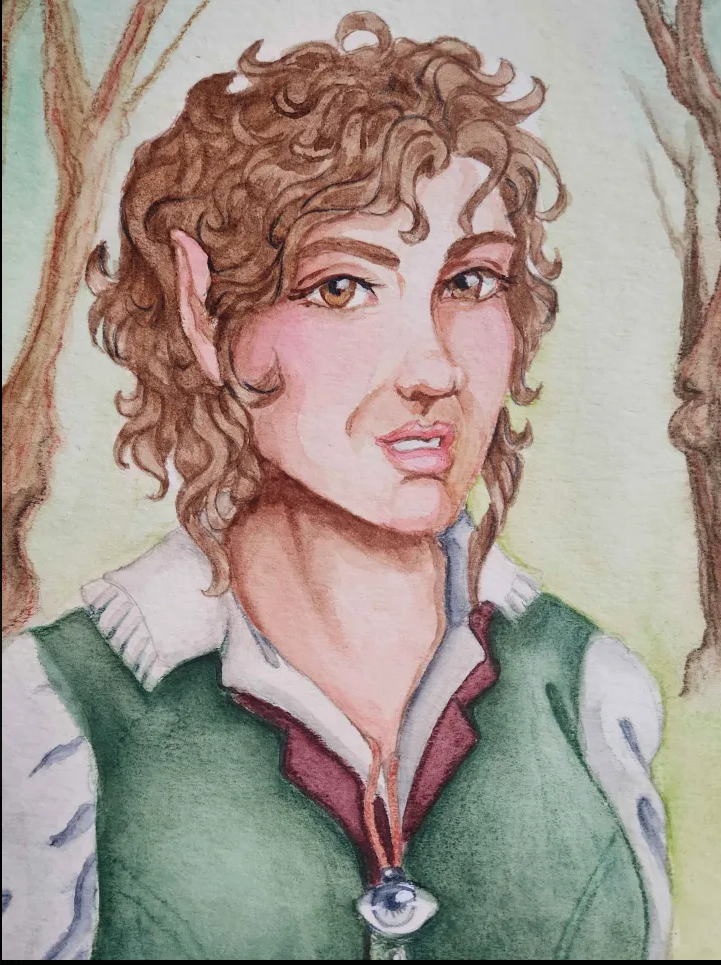
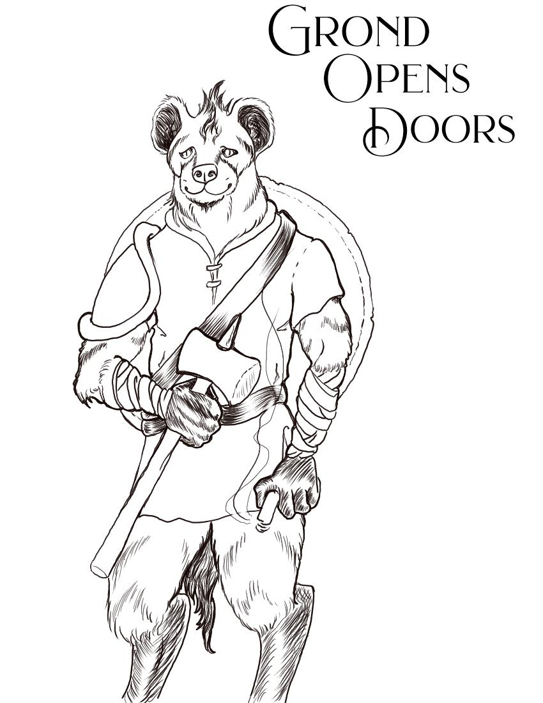
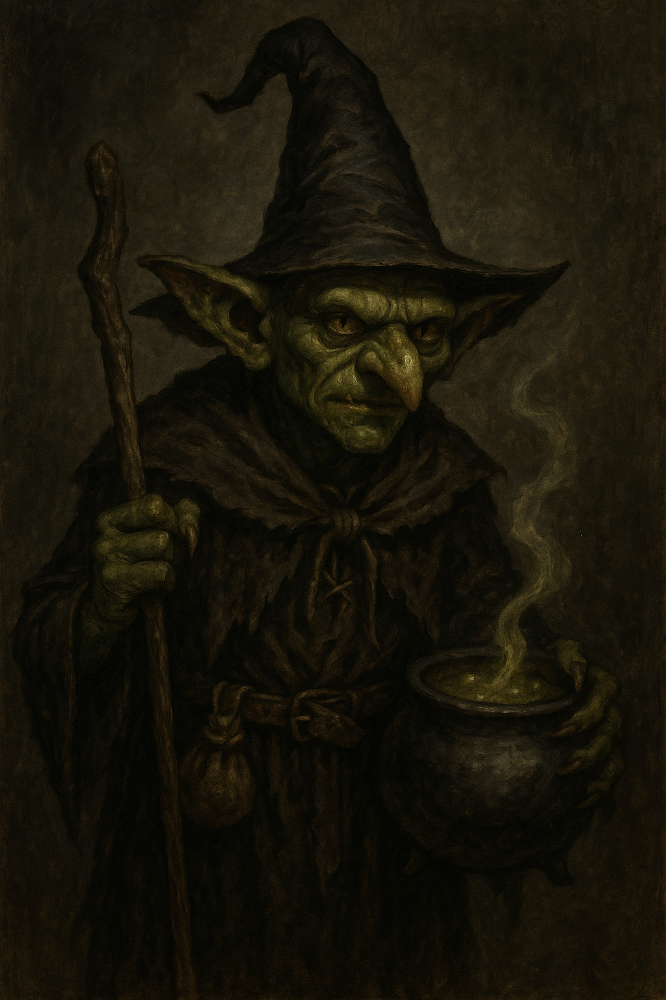
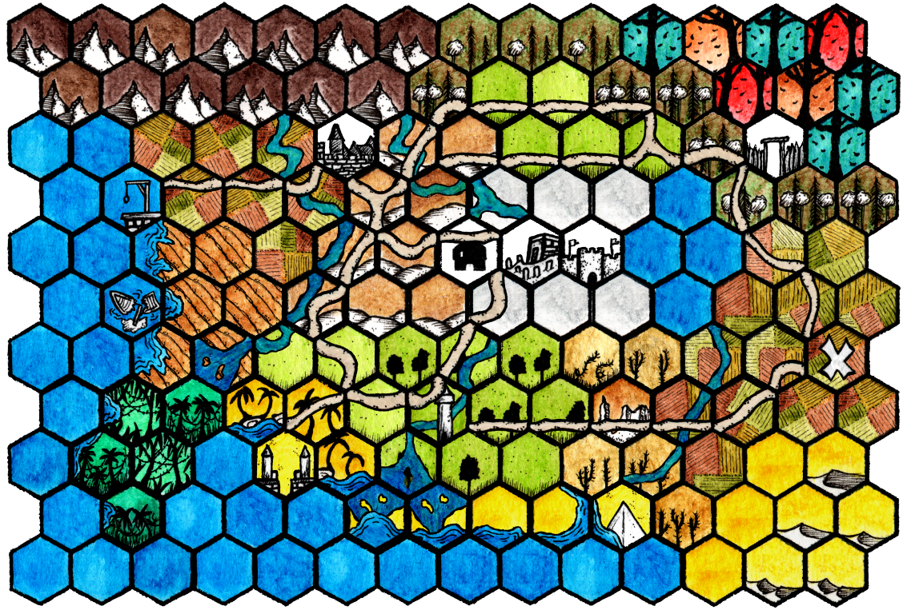

<section class="campaign-hero">

A Shadowdark Campaign Archive

<h2>Hooded Lantern Cartel</h2>

The Hooded Lantern Cartel used Helix as its base while exploring the Barrow Mounds. Its pursuit of a stolen corpse led through Mouse's deliveries to Mort, Mara, and Tornar in the serpent-and-skull marked mound. Eldran Vey's coat and papers…

</section>

## Campaign Now

[Read the full Previously On and current campaign state →](campaign-now/)

## The Party

<a class="party-card internal" href="./party/pc-sab"><strong>Sab</strong><small>Sab is the party's halfling priest: an Old Gods devotee, healer, anti-undead specialist, and frequent voice of caution. Her divine magic, crossbow, and halfling invisibility let her move between support, scouting, and precise violence.</small></a>
<a class="party-card internal" href="./party/pc-oogie"><strong>Oogie</strong><small>Oogie is a fungal seer whose trances, omens, and unusual perspective make him the party's occult support and intuitive investigator. His mycelial nature became materially important when the Fair Church restored him in its cemetery compost…</small></a>
<a class="party-card internal" href="./party/pc-orlin"><strong>Orlin</strong><small>Orlin is a shapechanging adventurer whose bear-form strength, healing, bow work, and alertness make him a flexible explorer. The table has described him as a beastmaster-in-training; a more exact class label has not been established in the…</small></a>
<a class="party-card internal" href="./party/pc-grond"><strong>Grond</strong><small>Grond is a kobold pit fighter and the party's most direct front-line bruiser. He favors practical force, shields companions in a retreat, and has also shown a surprisingly warm rapport with the people of Helix.</small></a>
<a class="party-card internal" href="./party/pc-gradrick"><strong>Gradrick</strong><small>Gradrick is the party's witch, a back-line spellcaster whose Eye Bite and practical magical knowledge have supported the group since its earliest recorded delves.</small></a>
<a class="party-card internal" href="./party/pc-dern">D<strong>Dern</strong><small>Dern is a dwarf Sea Wolf: a Viking-styled martial adventurer introduced during the same strange death-return sequence that restored Oogie.</small></a>

## Latest Session

**Session 18 · 2026-09-20**

The party explored the approach to Quasqueton, found edible berries and mushrooms, and learned from a fox that winged hunters threatened the lakeside. A song drew Sab up the trail until Grond restrained her. Two harpies attacked; Sab…

[Quick recap and detailed record →](sessions/2026_0920%20Session%2018)

## Threads in Motion

- **[Quasqueton / Hollow Gate](places/location-quasqueton)** — Quasqueton, called the Hollow Gate in a damaged writ recovered from Tornar's rooms, is the party's current expedition site. In Session 18 the group entered the outer watch rooms and chose an inner guardroom for shelter. They have not…
- **[The Hollow Gate Writ](active-leads/thread-hollow-gate-writ)** — The party recovered a damaged legal-looking writ from Tornar's rooms. It names the Hollow Gate of Quasqueton and grants a lawful bearer custody of its road-house, outer wall, spring, cave-mouth, stable court, and surrounding grounds,…
- **[Writ of the Hollow Gate](items/item-writ-of-hollow-gate)** — A damaged parchment in a wax-sealed leather tube recovered from Tornar's rooms. It names the Hollow Gate of Quasqueton and appears to grant a lawful bearer custody of the site's road-house, outer wall, spring, cave-mouth, stable court, and…
- **[Tongue of the Beast](items/item-wooden-tongue-carving)** — A wooden tongue found in Tornar's rooms and now held by Orlin. Mazzah identified it as a Tongue of the Beast. Its user places it in the mouth and spends a turn focusing on one kind of animal, after which the user can communicate with that…
- **[Arch / Archie](people/npc-arch-archie)** — Arch is the red devil-like figure associated with the party's strange tickets, deaths, and returns. Whether “Archie” names the figure, the tickets, or a broader system remains unresolved in the players' understanding.
- **[Archie ticket](items/item-archie-ticket)** — A death-return ticket tied to Archie, used to restore a dead companion through a still only partly understood ritual or contract.
- **[Beyond the Fog](active-leads/thread-beyond-the-fog)** — The party's world is beginning to widen beyond Helix and the western Barrow Mounds. Oogie's fading tablet map showed more mounds and a castle beyond them. Vakish identified the castle as Castle Zentolin and described the fog as the reason…
- **[Castle Zentolin](places/location-castle-zentolin)** — Legendary castle seen in Oogie's fading tablet-map vision and later named by Vakish. It sits on a crystal-clear lake beyond/east of the Barrow Mounds and has been cut off from contact by the fog.

## Recent Sessions

- **[Session 18 · 2026-09-20](sessions/2026_0920%20Session%2018)** — The party explored the approach to Quasqueton, found edible berries and mushrooms, and learned from a fox that winged hunters threatened the lakeside. A song drew Sab up the trail until Grond restrained her. Two harpies attacked; Sab…
- **[Session 17 · 2026-09-13](sessions/2026_0913%20Session%2017)** — The party returned to Helix, identified the marked-mound finds, sold its ordinary valuables, reported Mort's fate to the Fair Church, and hired Katherine Guy as an expedition helper. Mazzah identified several useful objects and interpreted…
- **[Session 16 · 2026-07-26](sessions/2026_0726%20Session%2016)** — The party finished searching the serpent-and-skull marked mound. Sab gave Mara's remains dignity and returned her wedding cord to Mort, whom Grond helped into a bed to sleep off the fortified ale. The party then opened the eastern crypt,…

## The Valley of Ruin

[Open the full map and regional guide](maps/valley-of-ruin)

## Explore

[Campaign Now](campaign-now/) · [Party](party/) · [Sessions](sessions/) · [World](world/) · [Leads](active-leads/) · [Timeline](timeline/) · [Maps](maps/) · [Archive](archive/)
