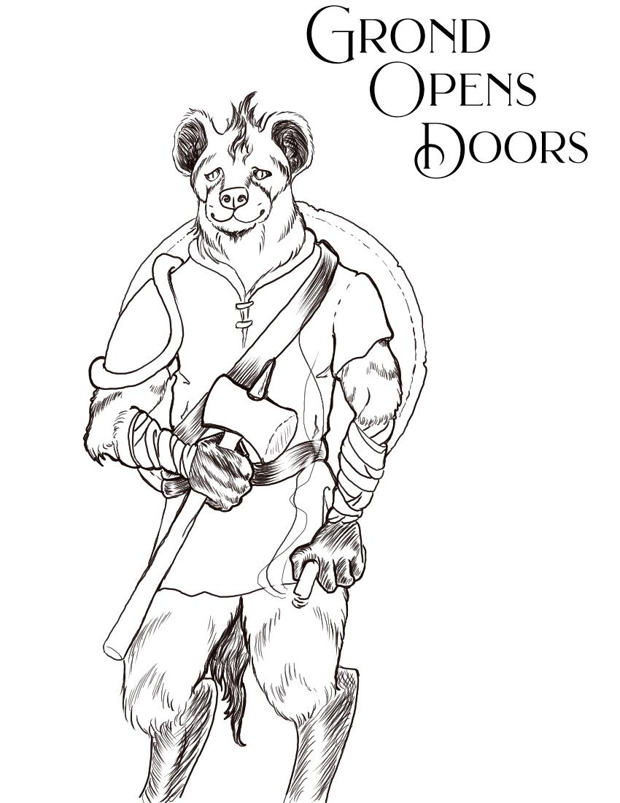

<figure class="entity-art">

</figure>

# Grond

## At a Glance

Grond is a kobold pit fighter and the party's most direct front-line bruiser. He favors practical force, shields companions in a retreat, and has also shown a surprisingly warm rapport with the people of Helix.

## Current Situation

Grond is active after the marked-mound confrontation and wears the [[item-hero-belt-gold-and-unicorn-horn-buckle|Belt of the Thornswild]], which grants him +4 Strength while worn. He remains closely associated with Werner's recovered sledgehammer. In Session 15 he received Holy Weapon, struck a bound rising corpse, and stayed with Mort after Mara disappeared.

## Defining History

- Fought through the road ambush and the party's first northern-barrows expedition.
- Refused to disarm during Nabo's hostage demand and emerged from the deadly camp confrontation with Werner's hammer recovered.
- Carried the Barrow Mounds retreat after Oogie fell and helped protect Mox during the later snake retreat.
- Won goodwill in Helix during the great Brazen Strumpet feast, including a public thank-you from Bolo and an enthusiastic audience of local children.
- Removed the hero belt from the Thornswild battle tableau, survived the resulting fight, and later kept it with Vakish's agreement.
- Helped Oogie reconstruct the fading tablet map before it vanished.
- Approached the marked mound's door, received Sab's Holy Weapon blessing, and struck one of Tornar's rising bodies.
- Offered physical comfort to Mort after Turn Undead ended the animation.

## Notable Possessions

- [[item-hero-belt-gold-and-unicorn-horn-buckle|Belt of the Thornswild]]
- Werner's recovered sledgehammer

## Relationships

- **Vakish Baharus:** gave the party the belt-buckle lead and ultimately accepted Grond keeping the belt.
- **Bolo and Helix:** Grond's conduct during the feast earned him unusual local affection.
- **The party:** shield-bearing frontliner and frequent solution to barred stone or wood.

## Uncertainty

The sledgehammer is sometimes called a warhammer in noisy transcripts. The campaign record treats those mentions as Werner's recovered hammer unless later play establishes a second weapon.

## Garden Connections

- [Sab](../party/pc-sab)
- [Oogie](../party/pc-oogie)
- [Orlin](../party/pc-orlin)
- [Gradrick](../party/pc-gradrick)
- [Dern](../party/pc-dern)
- [Bolo](../people/npc-bolo)
- [Vakish Baharus](../people/npc-vakish-baharus)
- [Belt of the Thornswild / Gold-and-Unicorn-Horn Buckle](../items/item-hero-belt-gold-and-unicorn-horn-buckle)
- [Mort](../people/npc-mort)
- [Tornar](../people/npc-tornar)
- [Serpent-and-Skull Marked Mound](../places/location-serpent-skull-marked-mound)
