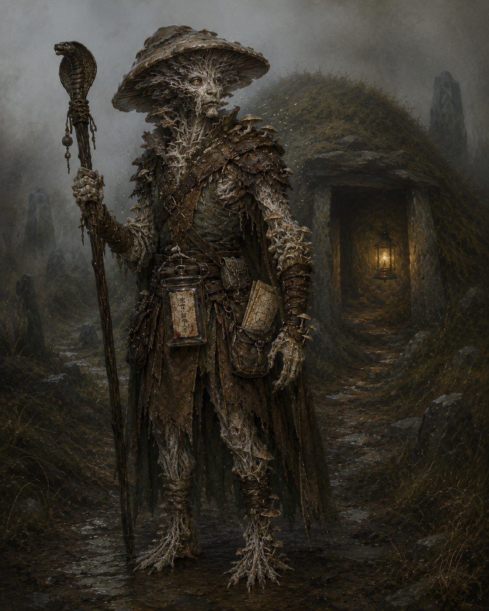

<figure class="entity-art">

</figure>

# Oogie

## At a Glance

Oogie is a fungal seer whose trances, omens, and unusual perspective make him the party's occult support and intuitive investigator. His mycelial nature became materially important when the Fair Church restored him in its cemetery compost after a fatal barrow expedition.

## Current Situation

Oogie is active in Helix and carries the newly identified [[item-cobra-headed-staff|Staff of the Cobra]]. He also keeps the party's rough copy of the fleeting map revealed by the chaotic tablet.

## Defining History

- Died after being isolated by a trap and attacked by marked skeletons beneath a prominent barrow.
- Returned through the Archie-ticket mystery and the Fair Church's intervention.
- Used Trance to reveal the tablet chamber in the Thornswild tomb and helped preserve part of the map that appeared when the tablet turned to ash.
- Took the cobra-headed staff from the broken-sigil mound and led the retreat when snakes emerged.
- Had Mazzah identify the staff in [[2026_0628 Session 14|Session 14]] and sold a chipped red gemstone for 20 gold.

## Notable Possessions

- [[item-cobra-headed-staff|Staff of the Cobra]]
- Rough copy of the tablet's Barrow Mounds map
- Returning dagger, passed to him by Sab
- Half of an [[item-archie-ticket|Archie ticket]] retained after his return

## Relationships

- **Dern:** entered the campaign through the same strange return sequence and was told to look after Oogie.
- **Mazzah:** the party's principal magical consultant and the person who identified Oogie's staff.
- **The Fair Church:** enabled Oogie's restoration despite Mort's hostility.

## Uncertainty

The copied tablet map is explicitly imperfect. Its larger geography should be treated as a lead, not a precise survey.

## Garden Connections

- [Sab](../party/pc-sab)
- [Orlin](../party/pc-orlin)
- [Gradrick](../party/pc-gradrick)
- [Grond](../party/pc-grond)
- [Dern](../party/pc-dern)
- [Mazzah](../people/npc-mazzah)
- [The Barrow Mounds](../places/location-barrow-mounds)
