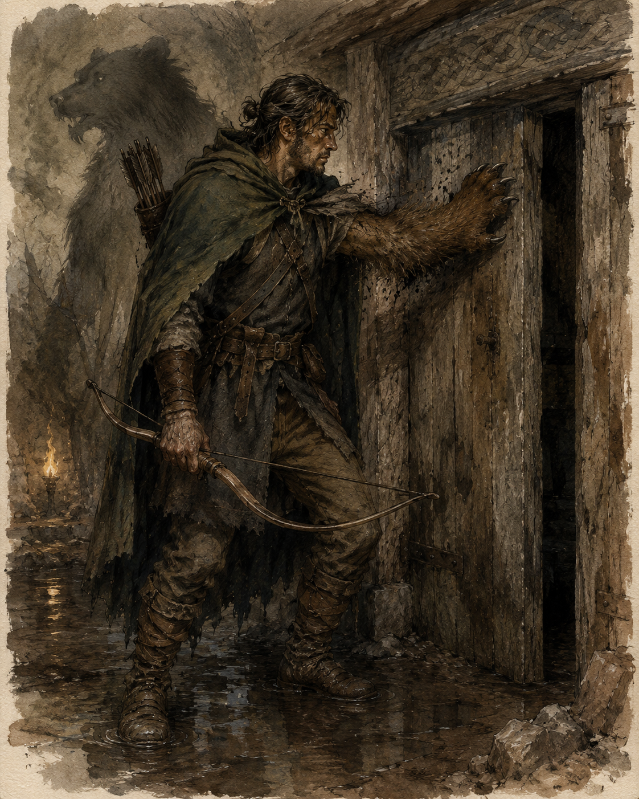

<figure class="entity-art">

</figure>

# Orlin

## At a Glance

Orlin is a shapechanging adventurer whose bear-form strength, healing, bow work, and alertness make him a flexible explorer. The table has described him as a beastmaster-in-training; a more exact class label has not been established in the campaign record.

## Current Situation

Orlin is active in Helix. In Session 14 he approached Mouse and Dennis directly and learned that Mouse had been paid to carry food and drink to someone living in a mound.

## Defining History

- Returned through the Archie-ticket system during the early dungeon expedition.
- Made the party's first direct gesture toward the red-robed watcher when the figure appeared in the mist and waved back.
- Used literal bear hands to force open swollen doors in the flooded ceremonial tomb.
- Helped read the Thornswild chamber's faded writing and fought the animated lizardfolk statues.
- Drew out Mouse's delivery story while the party investigated the marked mound.

## Relationships

- **Mouse and Dennis:** Orlin's direct conversation exposed the delivery schedule and the recipient's foul-smelling mound.
- **The party:** a core companion from the early dungeon through the current Helix investigation.

## Uncertainty

Orlin's class has been described indirectly through abilities and table talk. Shapechanging and a developing beastmaster identity are supported; a narrower label is not.

## Garden Connections

- [Sab](../party/pc-sab)
- [Oogie](../party/pc-oogie)
- [Gradrick](../party/pc-gradrick)
- [Grond](../party/pc-grond)
- [Dern](../party/pc-dern)
- [Mouse](../people/npc-mouse)
- [Serpent-and-Skull Marked Mound](../places/location-serpent-skull-marked-mound)
