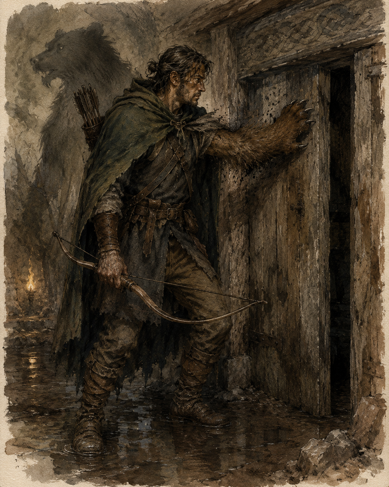

<figure class="entity-art">

</figure>

# Orlin

## At a Glance

Orlin is a shapechanging adventurer whose bear-form strength, healing, bow work, and alertness make him a flexible explorer. The table has described him as a beastmaster-in-training; a more exact class label has not been established in the campaign record.

## Current Situation

Orlin is with the party in [[location-quasqueton|Quasqueton's]] entrance guardroom, preparing to rest. He used the [[item-wooden-tongue-carving|Tongue of the Beast]] to speak with a fox that feared winged hunters, plugged his ears against the harpy song, and killed the second attacking harpy with his bow. He exposed writing in blood behind a skeleton pinned to an inner door, but could not read it.

## Defining History

- Returned through the Archie-ticket system during the early dungeon expedition.
- Made the party's first direct gesture toward the red-robed watcher when the figure appeared in the mist and waved back.
- Used literal bear hands to force open swollen doors in the flooded ceremonial tomb.
- Helped read the Thornswild chamber's faded writing and fought the animated lizardfolk statues.
- Drew out Mouse's delivery story while the party investigated the marked mound.
- Killed Tornar in bear form after the ritualist's animation attempt failed.
- Tore apart a ravenous zombie, held off the main clockwork cobra, and recovered its ruby eyes and unfamiliar mechanical heart.
- Used wolf form to resolve the Three Cairns encounter peacefully.

## Notable Possessions

- [[item-blue-cloud-potion|Blue cloud weightlessness substance]]
- [[item-claw-and-bone-talisman|Talisman of the Beastmaster]]
- [[item-wooden-tongue-carving|Tongue of the Beast]]
- [[item-session-15-spell-scroll-tube|Scroll of Spectacle]]

## Relationships

- **Mouse and Dennis:** Orlin's direct conversation exposed the delivery schedule and the recipient's foul-smelling mound.
- **Tornar:** killed the ritualist after Tornar animated the dead.
- **The party:** a core companion from the early dungeon through the current Helix investigation.

## Uncertainty

Orlin's class has been described indirectly through abilities and table talk. Shapechanging and a developing beastmaster identity are supported; a narrower label is not.

## Garden Connections

- [Sab](../party/pc-sab)
- [Oogie](../party/pc-oogie)
- [Gradrick](../party/pc-gradrick)
- [Grond](../party/pc-grond)
- [Dern](../party/pc-dern)
- [Serpent-and-Skull Marked Mound](../places/location-serpent-skull-marked-mound)
- [Tornar](../people/npc-tornar)
- [Blue Cloud Weightlessness Substance](../items/item-blue-cloud-potion)
