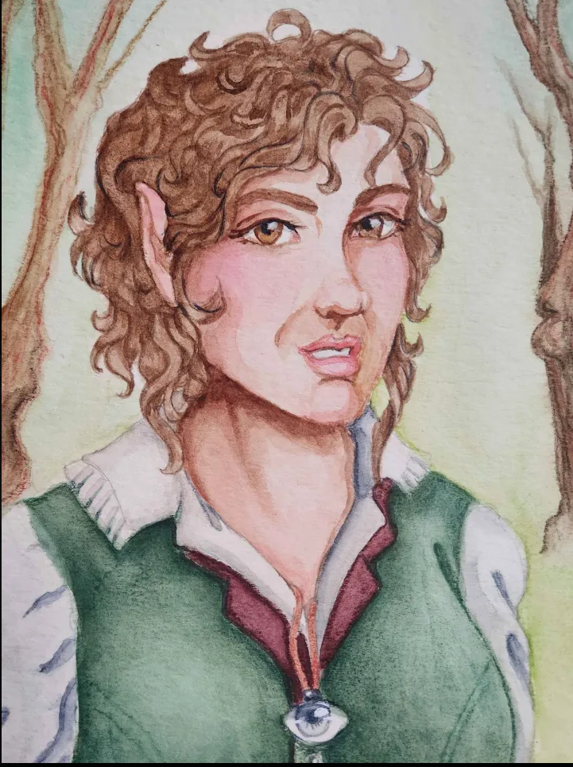

<figure class="entity-art">

</figure>

# Sab

## At a Glance

Sab is the party's halfling priest: an Old Gods devotee, healer, anti-undead specialist, and frequent voice of caution. Her divine magic, crossbow, and halfling invisibility let her move between support, scouting, and precise violence.

## Current Situation

Sab is active in Helix. She has a trusted line to [[npc-gant|Gant]] at the [[location-fair-church|Fair Church]] and is helping investigate Mort's disappearance and the missing corpse. Mazzah recently gave her a small spellbook containing Blind/Deafen.

## Defining History

- Helped destroy the gray ooze in the northern barrow and left with Tiramel's returning dagger.
- Scouted Werner's camp invisibly during the confrontation that killed Ikram, Nabo, and Werner.
- Used Turn Undead during the party's worst barrow retreats and helped bring Oogie to the Fair Church for restoration.
- Earned Gant's confidence when he showed her a Steel Bone half-mask found beneath Mort's bed.
- Honored the disturbed Thornswild dead and recovered the preserved shroud later identified as a [[item-cloak-of-elvenkind|Cloak of Elvenkind]].
- Reported the party's surveillance of the serpent-and-skull mound to Gant in [[2026_0628 Session 14|Session 14]].

## Notable Possessions

- [[item-cloak-of-elvenkind|Cloak of Elvenkind]]
- Blind/Deafen spellbook
- A Steel Bone half-mask connected to the suspicion around Mort

Sab passed Tiramel's returning dagger to Oogie in Session 12.

## Relationships

- **Gant:** a Fair Church contact who trusts Sab with his concerns about Mort.
- **Mort:** a missing church worker whose behavior remains suspicious but not fully explained.
- **The party:** Sab is the most consistently documented healer and one of its strongest defenses against undead.

## Uncertainty

The exact name of Sab's Old Gods tradition varies in table talk. Her devotion is established; a narrower doctrinal label is not.

## Garden Connections

- [Oogie](../party/pc-oogie)
- [Orlin](../party/pc-orlin)
- [Gradrick](../party/pc-gradrick)
- [Grond](../party/pc-grond)
- [Dern](../party/pc-dern)
- [Gant](../people/npc-gant)
- [The Fair Church](../places/location-fair-church)
