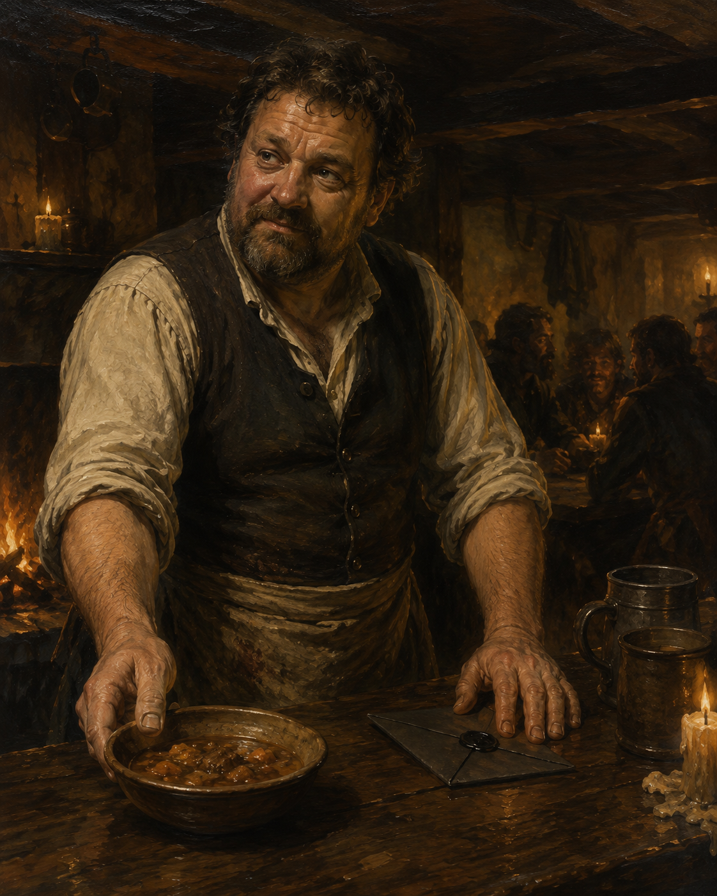

<figure class="entity-art">

</figure>

# Bolo

Bolo is the proprietor and barkeep of the [[location-brazen-strumpet|Brazen Strumpet]], and one of the party's most dependable sources of practical Helix gossip. He notices who is drinking, who owes money, and who has suddenly begun spending above their means.

## What He Has Done

- Identified Tacey for the party and explained Harlan's effort to buy her a ring.
- Connected Werner, Mazzah, the silver goblet, and the rival Iron Chain interest.
- Tracked Werner's growing tavern debt and passed along Celestia's summons.
- Helped turn the party's 100-gold carouse into a town-wide feast.
- Identified Mouse in Session 14 and agreed to fortify the ale intended for the marked mound's occupant.

## Relationships

Tacey works with him. Werner was a debtor. Mouse is a recognizable customer. The party are now trusted regulars rather than unknown adventurers passing through.

## Garden Connections

- [Parent: The Brazen Strumpet](../places/location-brazen-strumpet)
- [Tacey](../people/npc-tacey)
- [Mouse](../people/npc-mouse)
- [Helix](../places/location-helix)
- [Mort and the Marked Mound](../active-leads/thread-mort-and-marked-mound)
