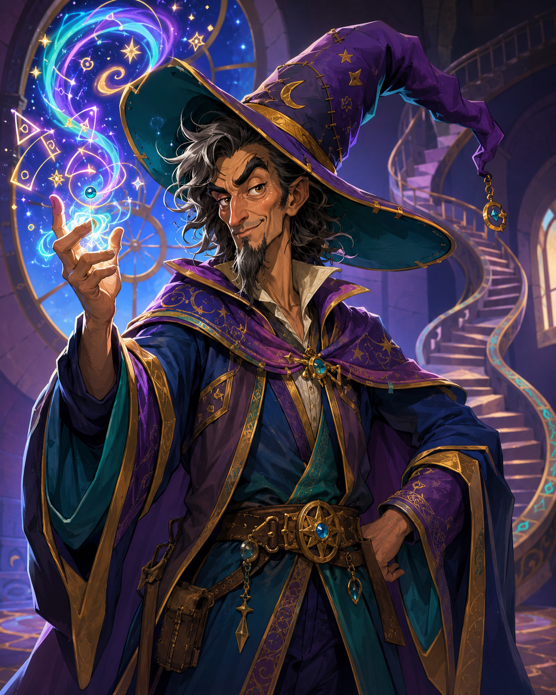

<figure class="entity-art">

</figure>

# Mazzah

Mazzah is Helix's eccentric wizard and the party's most reliable magical consultant. He is cooperative when approached on his terms, which are advertised by the many increasingly emphatic “do not disturb” signs around his tower.

## What the Party Knows

- Studied Werner's silver goblet and demonstrated that it could produce mead once per day before its magic ran out.
- Identified the potion of invisibility, bag of holding, Owl of Magnus, Cloak of Elvenkind, and Staff of the Cobra.
- Marked the mound north of the obelisk on the party's map.
- Keeps unusual objects for study and has become a trusted custodian for dangerous magic.

## Session 14

Mazzah identified Oogie's staff as a +1 Staff of the Cobra that can become a large serpent servant once per day. He bought Oogie's chipped red gemstone, accepted a skin-bound dark-arts spellbook for safekeeping, and gave Sab and Gradrick spellbooks containing Blind/Deafen and Hypnotize.

He associated the marked mound's symbol with an evil serpent-and-death tradition. His comments did not prove the exact deity or confirm that the site belongs to the Steel Bone Brotherhood.

## Garden Connections

- [Parent: Mazzah's Tower](../places/location-mazahs-tower)
- [Oogie](../party/pc-oogie)
- [Gradrick](../party/pc-gradrick)
- [Sab](../party/pc-sab)
- [Celestia](../people/npc-celestia)
- [Staff of the Cobra](../items/item-cobra-headed-staff)
- [Owl of Magnus](../items/item-crystal-owl)
