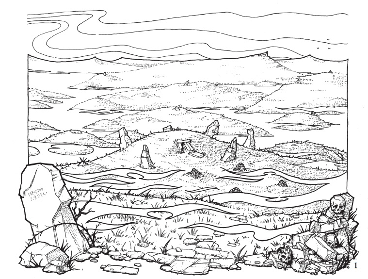

<figure class="entity-art">

</figure>

# The Barrow Mounds

The Barrow Mounds are a fog-bound field of ancient burial sites outside Helix. They are not one dungeon but a landscape of sealed tombs, looted chambers, active hideouts, and deeper structures whose dangers and histories often overlap.

## What the Party Has Learned

- The mounds vary dramatically in age, condition, and threat. Recent tracks and fresh paint can matter as much as an old map.
- The obelisk is a useful local landmark, but the party's map of the full field remains incomplete.
- The lifting fog appears to be reopening travel and drawing treasure hunters, merchants, and the Steel Bone Brotherhood into the same region.
- Some sites preserve Thornswild history; others show signs of recent ritual occupation or organized supply.

## Current Activity

- [[location-serpent-skull-marked-mound|Serpent-and-skull marked mound]] — entered and partially explored in Session 15; Mort was confirmed as the occupant, Tornar was killed, and the mound remains unfinished.
- [[location-broken-sigil-mound|Broken-Sigil Mound]] — partially explored; the party removed the Staff of the Cobra and left snakes, a sarcophagus, and another wing behind.
- [[location-third-vakish-mound|Third Vakish Mound]] — the main belt and Thornswild site; largely explored, with deep water deliberately left alone.

## Earlier Expeditions

- **Northern barrow:** the party fought a gray ooze, freed Ikram and Tiramel, and learned of Nabo's betrayal.
- **Mound north of the obelisk:** a note connected this area to the spent chalice and helped bring the Steel Bone mystery into focus.
- **Prominent shaft barrow:** marked skeletons and a trap killed Oogie before the party carried him back to Helix.
- **Vakish's three-mound lead:** yielded the gold jackals, the Belt of the Thornswild, the Cloak of Elvenkind, and the chaotic tablet-map clue.

## Connections

[[location-helix|Helix]] is the expedition hub. [[npc-finn|Finn]] supplied early mapping and lantern work. [[npc-vakish-baharus|Vakish Baharus]] converted several tomb finds into money and wider regional leads. The [[faction-steel-bone-brotherhood|Steel Bone Brotherhood]] is a recurring presence, though not every ominous symbol or occupied mound has been proven to belong to it.

## Uncertainty

The party has seen only part of the mound field. Oogie's fading tablet map expanded the apparent scale of the region but was copied imperfectly. The marked mound's altar, remaining rooms, and relationship to the Brotherhood remain unresolved.

## Garden Connections

- [Helix](../places/location-helix)
- [Serpent-and-Skull Marked Mound](../places/location-serpent-skull-marked-mound)
- [Broken-Sigil Mound](../places/location-broken-sigil-mound)
- [Third Vakish Mound](../places/location-third-vakish-mound)
- [Steel Bone Brotherhood](../factions/faction-steel-bone-brotherhood)
- [Already-open barrow](../places/location-already-open-barrow)
- [mound north of the obelisk](../places/location-mound-north-of-the-obelisk)
- [Obelisk area](../places/location-obelisk-area)
- [Prominent Barrow with Standing Stones and Shaft](../places/location-prominent-barrow-with-standing-stones-and-shaft)
- [Sealed barrow with nested casket](../places/location-sealed-barrow-with-nested-casket)
- [Sealed Mound on Torn Map](../places/location-sealed-mound-on-torn-map)
- [Southern Candidate Barrow](../places/location-southern-candidate-barrow)
- [Water-filled barrow tomb](../places/location-water-filled-barrow-tomb)
- [Northern Barrow](../places/location-northern-barrow)
