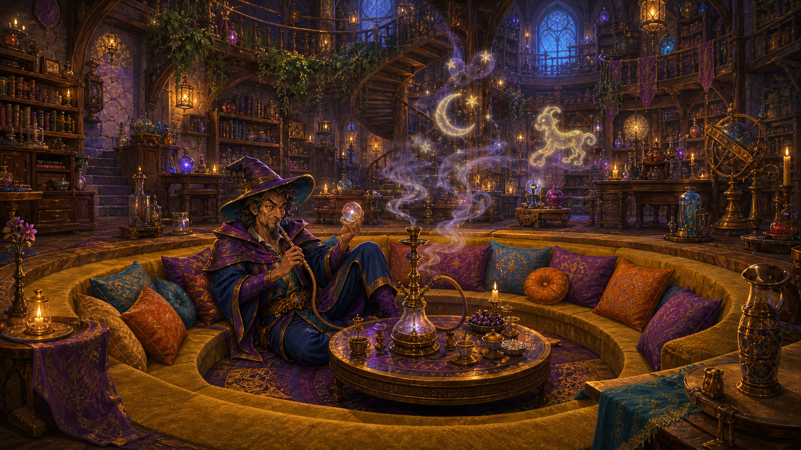

<figure class="entity-art">

</figure>

# Mazzah's Tower

Mazzah's tower is the Helix wizard's home, workshop, and the party's principal stop for magical identification. It is larger and more comfortable inside than its exterior suggests, and repeated “do not disturb” signs are backed by a warning illusion.

## In the Campaign

- Mazzah studied Werner's silver goblet, demonstrated its daily mead-making power, and later confirmed that its magic had been spent.
- Celestia met the party here to follow up on her goblet commission.
- The black pouch was identified here as a bag of holding, and Mazzah marked the mound north of the obelisk on the party's map.
- The Owl of Magnus and Sab's Cloak of Elvenkind were identified here.
- In Session 14, Mazzah identified the Staff of the Cobra, bought Oogie's red gemstone, and accepted a dangerous skin-bound spellbook for safekeeping. Sab and Gradrick received smaller spellbooks in exchange.
- In Session 17, Mazzah identified the marked-mound finds, interpreted Eldran Vey's papers as a possible claim to Quasqueton, accepted Tornar's journals for study, and gave Gradrick a plant-speaking draught. Sab destroyed the Wand of Unlife outside.

Mazzah's expertise is reliable; his conclusions about the serpent-and-skull symbol were cautious rather than a definitive identification of its cult.

## Garden Connections

- [Parent: Helix](../places/location-helix)
- [Mazzah](../people/npc-mazzah)
- [Celestia](../people/npc-celestia)
- [Owl of Magnus](../items/item-crystal-owl)
- [Staff of the Cobra](../items/item-cobra-headed-staff)
