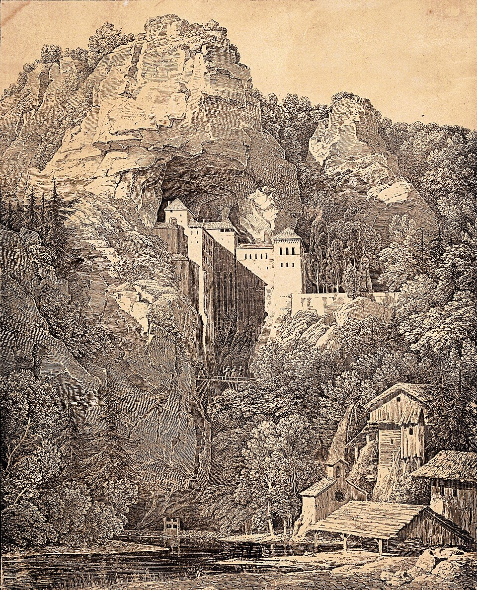

# Quasqueton / Hollow Gate

Quasqueton, called the Hollow Gate in a damaged writ recovered from Tornar's rooms, is the party's current expedition site. In Session 18 the group entered the outer watch rooms and chose an inner guardroom for shelter. They have not completed a rest or explored deeper.

## What the Party Has Seen

The writ names a road-house, outer wall, spring, cave-mouth, stable court, and appurtenant grounds. It claims custody for a lawful bearer, subject to Rogahn the Fearless, Zelligar the Unknown, or an heir lawfully named beneath both seals. The lower half of the document is damaged.

Eldran Vey's brass plate names him as steward of Quasqueton and keeper of its road, spring, and outer wall. Mazzah examined the coat and papers in Session 17 and interpreted them as a possible ownership claim.

Mazzah said Rogahn and Zelligar built the unfinished stronghold with magic, paid workers, and captive orcs after rising to fame against a northern barbarian invasion. He also relayed rumors of walls that speak the builders' names, secret rooms made by the captive orcs, and a glowing stone whose pieces grant dangerous wishes when swallowed. These are reports and rumors, not party observations.

The approach follows the road past the Three Cairns and the ruined bridge at White Falls. The stronghold's pale walls, narrow roofs and windows, and waterfalls appear built directly into limestone cliffs above a cold green lake.

The following engraving was shared as visual inspiration for Quasqueton. It is not a literal depiction of the stronghold or a map of its features.

In Session 18 the party found edible berries and mushrooms on the approach. A fox told Orlin that winged hunters made fishing at the lake dangerous. The waterfall spray broke oddly at one point, suggesting a possible hollow behind it; no one checked. A haunting song compelled Sab until Grond restrained her. Two harpies attacked and were killed, but singing continued from an unseen source above.

The abandoned upper camp yielded a collapsible fishing pole and a small jar of damp-hardened salt, both taken by Sab. The outer doors stood partly open. At the inner threshold a disembodied voice challenged entrants to speak their names in the house of Rogahn and Zelligar; it did not answer Sab's claim of ownership. A skeleton had been pinned to a door with a crude sword, covering writing in blood that appeared to be Orcish. No party member read it. Beyond were watch rooms overlooking the bridge and trail. The party closed doors behind itself and chose a small guardroom with rusted shutter mechanisms as a campsite.

## Current Relevance

The party explicitly chose Quasqueton over the road to Castle Zentolin and is now inside its entrance guardroom, preparing to rest under watch. Quasqueton is a distinct stronghold from Castle Zentolin.

## Uncertainty

The writ's legal force, the meaning of “lawful bearer,” the occupants beyond the entrance, the voice's source, the continuing singer, the Orcish message, and the truth behind Mazzah's rumors remain unresolved.

## Garden Connections

- [Writ of the Hollow Gate](../items/item-writ-of-hollow-gate)
- [Castle Zentolin](../places/location-castle-zentolin)
- [Serpent-and-Skull Marked Mound](../places/location-serpent-skull-marked-mound)
- [The Hollow Gate Writ](../active-leads/thread-hollow-gate-writ)
