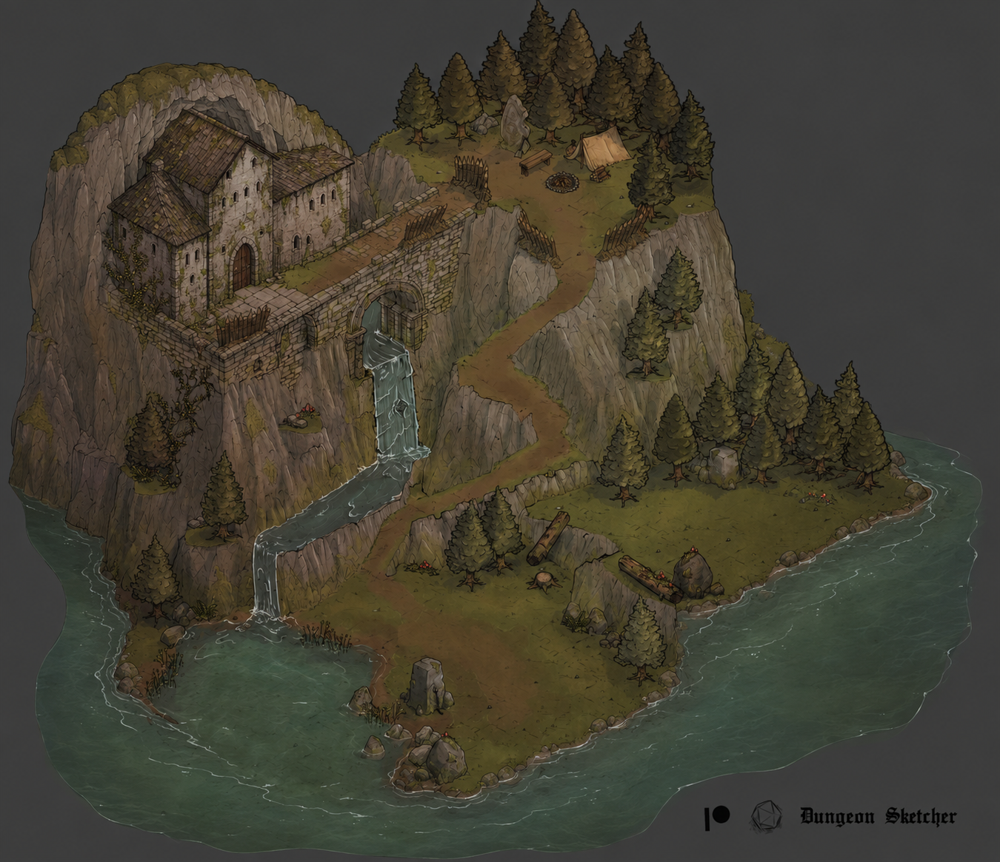
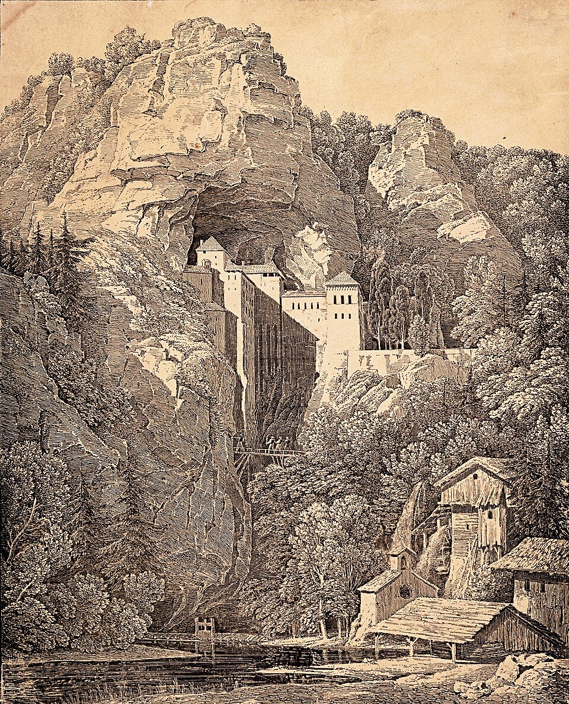

# Quasqueton / Hollow Gate

Quasqueton, called the Hollow Gate in a damaged writ recovered from Tornar's rooms, is the party's current expedition site. After clearing the upper harpy nest and meeting [[npc-greenheart|Greenheart]], the party continued through the upper corridors in [[2026_1101 Session 21|Session 21]]. It killed a many-eyed hunter, found a hidden greenkin nursery, and went on to explore an exercise room and a chamber of strange pools. Areas below and many interior branches remain unexplored.

## What the Party Has Seen

The writ names a road-house, outer wall, spring, cave-mouth, stable court, and appurtenant grounds. It claims custody for a lawful bearer, subject to Rogahn the Fearless, Zelligar the Unknown, or an heir lawfully named beneath both seals. The lower half of the document is damaged.

Eldran Vey's brass plate names him as steward of Quasqueton and keeper of its road, spring, and outer wall. Mazzah examined the coat and papers in Session 17 and interpreted them as a possible ownership claim.

Mazzah said Rogahn and Zelligar built the unfinished stronghold with magic, paid workers, and captive orcs after rising to fame against a northern barbarian invasion. He also relayed rumors of walls that speak the builders' names, secret rooms made by the captive orcs, and a glowing stone whose pieces grant dangerous wishes when swallowed. These are reports and rumors, not party observations.

The approach follows the road past the Three Cairns and the ruined bridge at White Falls. The stronghold's pale walls, narrow roofs and windows, and waterfalls appear built directly into limestone cliffs above a cold green lake.

The following engraving was shared as visual inspiration for Quasqueton. It is not a literal depiction of the stronghold or a map of its features.

In Session 18 the party found edible berries and mushrooms on the approach. A fox told Orlin that winged hunters made fishing at the lake dangerous. The waterfall spray broke oddly at one point, suggesting a possible hollow behind it; no one checked. A haunting song compelled Sab until Grond restrained her. Two harpies attacked and were killed, but singing continued from an unseen source above.

The abandoned upper camp yielded a collapsible fishing pole and a small jar of damp-hardened salt, both taken by Sab. The outer doors stood partly open. At the inner threshold a disembodied voice challenged entrants to speak their names in the house of Rogahn and Zelligar; it did not answer Sab's claim of ownership. A skeleton had been pinned to a door with a crude sword, covering writing in blood that appeared to be Orcish. No party member read it. Beyond were watch rooms overlooking the bridge and trail. The party closed doors behind itself and chose a small guardroom with rusted shutter mechanisms as a campsite.

In Session 19 the guardroom rest completed without an attack. Sab plugged an old rat hole with fresh seed husks beside it; Gradrick heard distant laughter from above, and Grond found a faded sword-and-star mark. Oogie detected faint bitter incense, later independently confirmed by Grond, coming from deeper inside. Beyond the double doors lay a vaulted hall with a shallow fountain basin bearing the builders' emblem and an apparently plugged drain. Oversized rodent tracks led down the interior hallway and up and down an ascending stair.

The party went upstairs to secure outside provisioning. The upper circular tower contained a raised nest of bones, fur, feathers, glass scraps, and valuables. Grond critically wounded its lone visible harpy, and Oogie's summoned cobra killed it. No other harpies or eggs were found nearby, and Wade described the nest as fully cleared. Three harpies have been killed across Sessions 18 and 19. The nest contained animal, oversized rodent, and humanoid bones, 42 gold, Sab's silver-finished mirror, and Oogie's nonmagical sword-and-star buckle. Clearing this immediate threat does not establish that the entire stronghold is safe.

In Session 20 a passage off the upper tower was blocked by dense vegetation. A moss-furred, leaf-eared rat led the party through dark branching corridors after Orlin spoke with it. Two venomous centipedes were killed on the way; Gradrick took one damage without poisoning. Behind an old mold-covered door lay [[npc-greenheart|Greenheart's nursery]], with deep vegetation, glowing fungi, raised rat nests, and the pulsing three-chambered plant. The party entered peacefully and accepted a conditional [[thread-greenheart-captives|rescue or peace request]] concerning web-using captors below.

A contrasting pristine door opened onto [[npc-lumpy|Lumpy's]] familiar, warm equipment room. Oogie bought rope, returned to the corridor, and the door closed behind him. The mechanism and permanence of the connection remain unknown.

In [[2026_1101 Session 21|Session 21]], the party passed Lumpy's door without reopening it and encountered a many-eyed arachnid-orc hunter with a hooked spear and web-like net. Oogie's rapport spores conveyed a vision of a spiderlike female controlling similar hunters and a rat-catching duty. After being bound, the hunter spat purple liquid that fizzed on stone; Orlin dodged, and Oogie killed it with Fate. Its descent from the builders' captive orcs remains party speculation.

The concealed entrance it had been investigating led into an abandoned food storeroom with composting barrels, four greenkin mothers, and roughly thirty young. Grond enlarged the entrance; Sab found that it was healing shut again. A second small exit led to the adjacent corridor. Orlin reassured the mothers, gave a ration, and recovered a sepia gem estimated at 30 gold. These inhabitants were not established to be Greenheart's missing captives. Oogie's fungal contact showed a gray stone pool whose drink killed a greenkin; the pool was neither visited nor located.

Grond then forced an eastern door with rusty fittings. Gradrick's lantern revealed weapon holders, weighted bars, a bench, and brittle mats: an apparent exercise room or dojo. Play stopped at this initial view, with the group regrouping and discussing remaining light supplies.

In [[2026_1108 Session 22|Session 22]], the party killed giant red centipedes in the exercise room and Sab recovered a magical lion-faced +1 shield. Thorn-bearing greenkin in an old carpenter’s room reported two web takers arriving from eastern stairs, one going north and one west. A dead silkbound lay beside a corrosive basin; Sab used its mace to recover a brass key. The group defeated an ochre jelly and investigated numerous pools with varied liquids and effects. Near illusory treasure Orlin felt a breeze, Gradrick found a rotating wall, and Orlin opened it to an unexplored room. A broad staircase descends beyond the party’s light. See the session record for pool observations and uncertainties.

## Current Relevance

The party is at the pool chamber with Katherine Guy, beside an opened rotating wall leading to an unexplored room. Greenheart's rescue-or-peace request remains incomplete: no actual captives or heart seed were recovered. A psychic link showed a spiderlike female controlling altered orcish hunters; her location and origins remain unknown. Oogie's mushroom contact also showed a greenkin dying after drinking gray liquid from a stone pool, whose identification and nature remain unverified. A gray syrupy pool was found, but has not been linked conclusively to the vision. Light supplies are an immediate concern, and Lumpy's door has not been retested. The incense source and wider interior remain unexplored. Quasqueton is distinct from Castle Zentolin.

## Uncertainty

The writ's legal force, the meaning of “lawful bearer,” the wider stronghold's occupants, the incense source, whether the nursery's rats made all earlier rodent tracks, the entrance voice, the Orcish blood message, the possible waterfall hollow, and Mazzah's rumors remain unresolved.

## Garden Connections

- [Greenheart](../people/npc-greenheart)
- [Lumpy](../people/npc-lumpy)
- [Greenheart's Captives and Heart Seed](../active-leads/thread-greenheart-captives)
- [Katherine Guy](../people/npc-katherine-guy)
- [Staff of the Cobra](../items/item-cobra-headed-staff)
- [Writ of the Hollow Gate](../items/item-writ-of-hollow-gate)
- [Castle Zentolin](../places/location-castle-zentolin)
- [Serpent-and-Skull Marked Mound](../places/location-serpent-skull-marked-mound)
- [The Hollow Gate Writ](../active-leads/thread-hollow-gate-writ)
