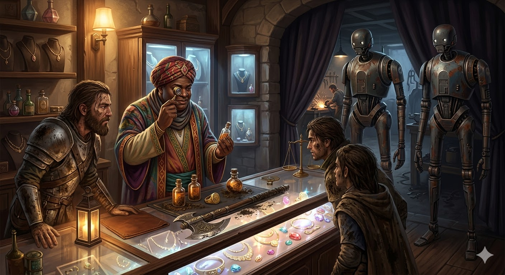

<figure class="entity-art">

</figure>

# The Rose Quartz

The Rose Quartz is Vakish Baharus's jewelry and curio shop in Helix. It is the party's best market for fancy grave goods and an important source of regional knowledge.

## In the Campaign

- Vakish bought the gold ring and four amber perfume vials after Oogie's return.
- His three-mound belt lead led the party to gold jackals, the Belt of the Thornswild, and the wider Thornswild mystery.
- The shop was attacked during the predawn raid after the Brazen Strumpet feast; Vakish's mechanical guards killed several raiders.
- In Session 12, the party sold rings and an ornate urn, returned the second jackal, and discussed Thornswild, the fog, and Castle Zentolin.

The Rose Quartz is a commercial relationship, but Vakish's maps and memory have made it part of the campaign's bridge from local barrow delving to wider travel.

## Garden Connections

- [Parent: Helix](../places/location-helix)
- [Vakish Baharus](../people/npc-vakish-baharus)
- [Third Vakish Mound](../places/location-third-vakish-mound)
- [Castle Zentolin](../places/location-castle-zentolin)
- [Thornswild](../places/location-thornswild)
