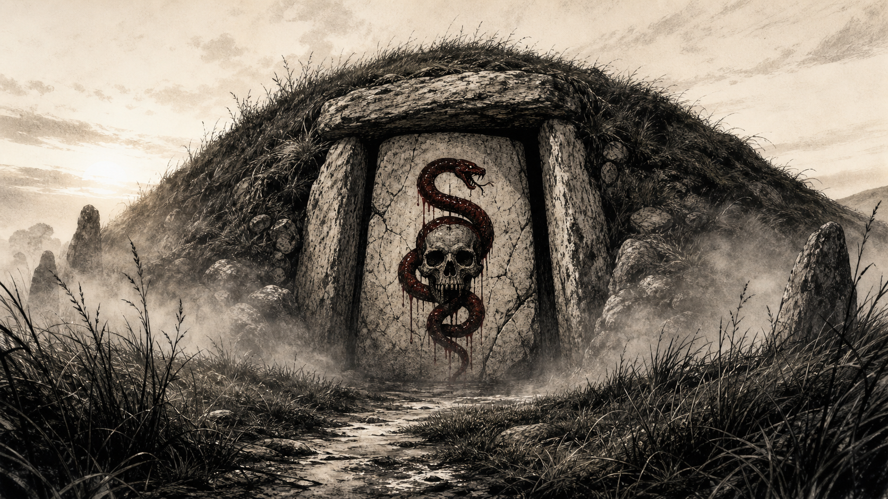
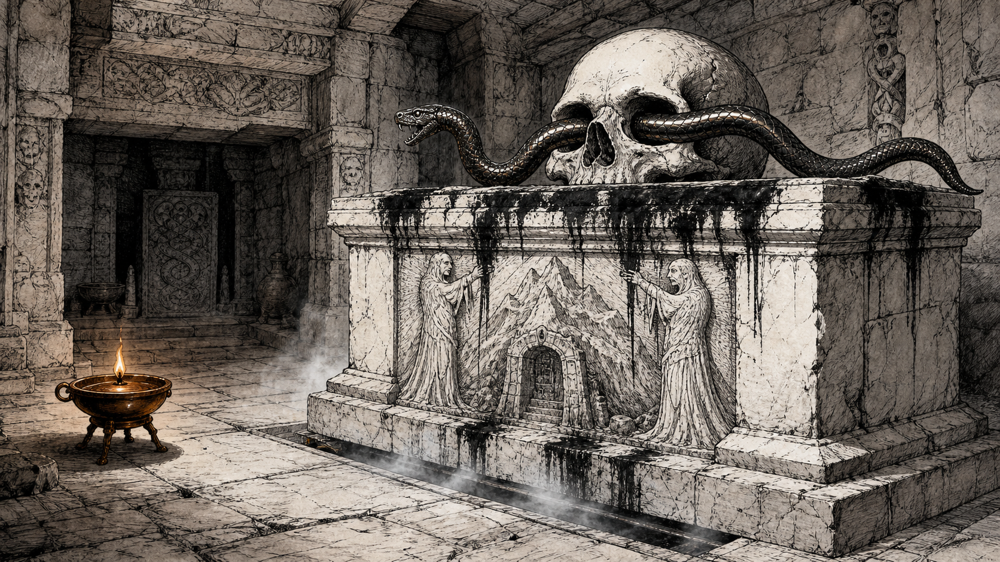

# Serpent-and-Skull Marked Mound

A smaller mound whose door bore a freshly painted black serpent curled around a skull. The party entered it in Session 15 and cleared its remaining eastern crypt in Session 16. The north altar remains unopened.

## Session 15 Visual References

## What the Party Has Seen

- A large, broad-shouldered figure entered the mound alone at night.
- Mouse delivers food and sour ale twice each day.
- The concealed knock is two taps, a pause, then one tap on a side stone.
- Gradrick's owl saw a large gray-green hand and shoulder receive a delivery through the partly opened door.
- Dennis described the interior smell as resembling a bad butcher's shop.
- The painted serpent ward animated when Oogie touched the door, but treated him as friendly because he carried the Staff of the Cobra.
- The entrance hall contained an undead maid named Nara, who swept, carried iron keys, and retained household routines.
- A warm altar in the north of the hall has an iron serpent threaded through a white stone skull. Scratches around its base suggest that it moves, but the party did not open it.
- The western workroom held Mort, Mara's wrapped body, Tornar, an animation circle, prepared dead, and Tornar's ritual tools.
- The eastern crypt held four ravenous zombies and a grave-goods display guarded by one large clockwork cobra and two smaller clockwork snakes.
- One zombie wearing an ornate coat was Eldran Vey, steward of Quasqueton. His plate strengthens the connection to the Hollow Gate writ. Gradrick recovered his coat and papers.

## Outcome

The fortified delivery was completed. The party entered after waiting for the ale to take effect, confirmed that Mort was the occupant, stopped Tornar's attempted animation, killed Tornar, and recovered a finger-bone wand, journals, valuables, unidentified objects, and the Hollow Gate writ. In Session 16, Sab honored Mara's remains, Mort was put to bed, and the party destroyed the eastern room's undead and clockwork guardians.

## Current State and Uncertainty

The known western and eastern rooms are cleared. The altar mechanism and its possible descent remain unresolved. The party traveled safely toward Helix, where the next session will open with its arrival. Mort was last explicitly asleep in the mound, and whether he accompanied the party remains unresolved. The symbol may connect the mound to the Steel Bone Brotherhood, although no direct Brotherhood presence or ownership of Tornar's ritual was confirmed.

## Garden Connections

- [Parent: The Barrow Mounds](../places/location-barrow-mounds)
- [Mort](../people/npc-mort)
- [Mara](../people/npc-mara)
- [Tornar](../people/npc-tornar)
- [Nara](../people/npc-nara)
- [Eldran Vey](../people/npc-eldran-vey)
- [Mouse](../people/npc-mouse)
- [Gant](../people/npc-gant)
- [Steel Bone Brotherhood](../factions/faction-steel-bone-brotherhood)
- [Quasqueton / Hollow Gate](../places/location-quasqueton)
- [Mort and the Marked Mound](../active-leads/thread-mort-and-marked-mound)
- [The Hollow Gate Writ](../active-leads/thread-hollow-gate-writ)
- [Finger-bone wand](../items/item-finger-bone-wand)
- [Writ of the Hollow Gate](../items/item-writ-of-hollow-gate)
