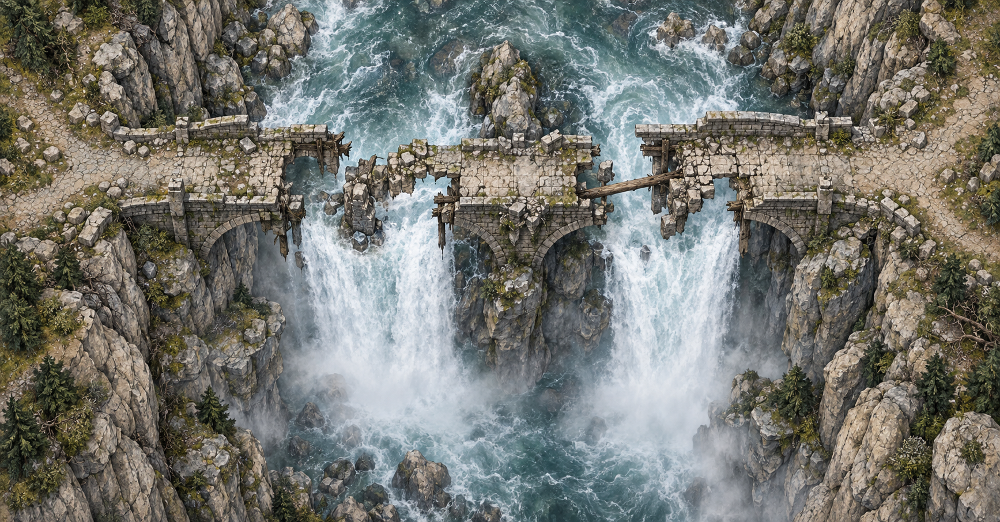
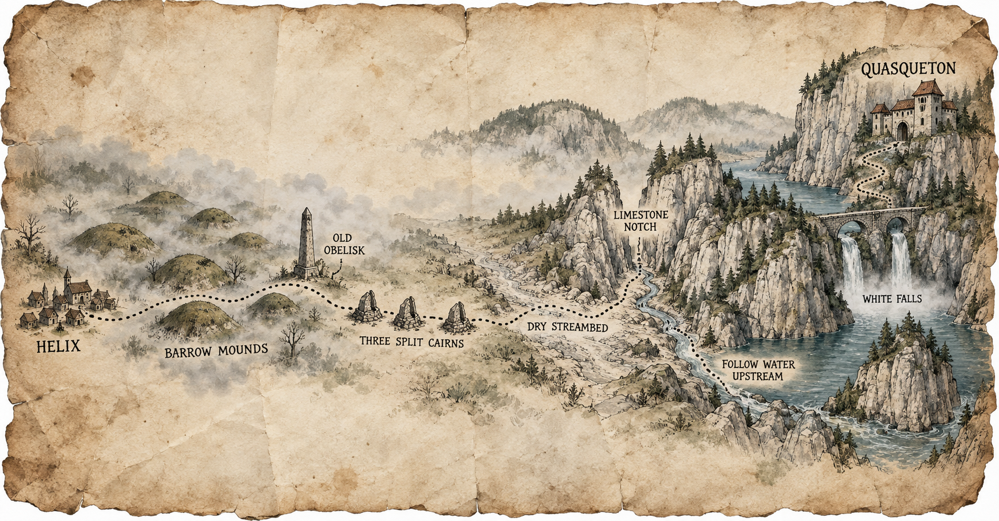

# Session Note

Quick Read

## Executive Summary

The party returned to Helix, identified the marked-mound finds, sold its ordinary valuables, reported Mort's fate to the Fair Church, and hired Katherine Guy as an expedition helper. Mazzah identified several useful objects and interpreted Eldran Vey's papers as a possible claim to Quasqueton. Sab destroyed the necromantic Wand of Unlife, while Mazzah accepted Tornar's journals for study and gave Gradrick a draught for speaking with plants. The next morning the party traveled beyond the Barrow Mounds, peacefully drove off two starving wolves near the Three Cairns, crossed the ruined bridge at White Falls with a one-use magic-carpet scroll, and chose Quasqueton over the road to Castle Zentolin. Play ended at the cold green lake below Quasqueton's cliff-built stronghold, before anyone entered.

[Jump to the detailed record →](#what-happened)

## What Happened

The party arrived in Helix carrying the marked mound's recovered objects, Eldran Vey's coat and papers, and saleable grave goods. At [[location-mazahs-tower|Mazzah's tower]], Mazzah identified Orlin's blue cloud-filled substance as an ointment or potion capable of making a creature weightless, with flight or levitation depending on how it is used. He identified the claw-and-bone cord as a Talisman of the Beastmaster, granting a +1 bonus to natural attacks, and the wooden tongue as a Tongue of the Beast, which permits communication with one chosen kind of animal after a turn of focus.

Mazzah recoiled from Tornar's finger-bone wand and identified it as a Wand of Unlife capable of animating a corpse at an unknown cost. Sab carried it outside, broke it underfoot, and heard an evil cackle as it dissolved into dust.

Eldran Vey's coat and papers concerned [[location-quasqueton|Quasqueton]], an unfinished stronghold built by Rogahn the Fearless and Zelligar the Unknown. Mazzah interpreted the papers as a writ of ownership, but their present legal force remains untested. He described the builders as powerful adventurers who broke a northern barbarian invasion, built Quasqueton with magic, paid workers, and captive orcs, then departed south and east with their followers and never returned. He also relayed rumors of speaking walls, hidden orc-built rooms, and a glowing stone whose pieces grant dangerous wishes when swallowed. These claims remain reports rather than party observations.

Mazzah identified one scroll as a temporary magic-carpet spell. The party also clarified that its old adamantine bar is a magical door-bar capable of holding a door shut. Orlin's other scroll was recalled and identified as a Scroll of Spectacle, which creates an obviously unreal, building-sized illusion with motion and sound for at least a day. Gradrick left Tornar's journals with Mazzah for study; Mazzah gave Gradrick a root-filled draught said to permit speech with plants.

At the [[location-rose-quartz|Rose Quartz]], Vakish bought the chest, its ordinary valuables, the clockwork cobra's mechanical heart, the precision spring, and the other offered components for 200 gold pieces. Each of the five participating PCs received 40 gold. Oogie retained the clockwork venom reservoir.

Sab then privately told Bartholomew at the [[location-fair-church|Fair Church]] that Mort had followed Tornar in hope of restoring Mara, had not attacked after the rite failed, and had been left grieving and remorseful. Bartholomew said the church's door remained open to Mort. Sab donated five gold. Mort himself remained asleep in the marked mound; he had not yet returned to Helix.

At the [[location-brazen-strumpet|Brazen Strumpet]], the party hired [[npc-katherine-guy|Katherine Guy]] to carry light and supplies, help make camp, cook, and handle animals. Her wage was set at one gold per day, or two on a day involving combat. The party rested, resupplied, and set out with her the next morning.

Beyond the Barrow Mounds, the party reached the Three Cairns. Two visibly starving wolves approached. Oogie used Trance on Sab and saw several possible outcomes, including violence and a larger healthy wolf driving the starving pair away. Orlin transformed into a wolf, offered a ration, and used his greater size and posture to warn the animals off. They split the food and fled without a fight. Grond later found ten gold beneath stones in one cairn and divided it evenly, two gold to each PC. Sab tested the nearby old well; its water was exceptionally fresh, and the party refilled its waterskins. Nothing established the water as magical.

At White Falls, the double-arched bridge had partially collapsed over the roaring water. Grond drove a piton into the stone with Werner's sledgehammer, Sab tied off a rope, and Gradrick successfully cast the magic-carpet scroll. The carpet carried the five PCs and Katherine across while the group ran the rope to the far side. The spell expired later that day and the scroll was consumed.

The road beyond White Falls split between [[location-quasqueton|Quasqueton]] to the northeast and [[location-castle-zentolin|Castle Zentolin]] on the other route. The party explicitly chose Quasqueton. They followed the road to a cold green lake beneath a limestone mountain, where pale walls, narrow roofs and windows, and waterfalls appeared built into the cliff. The session ended before the party entered.

## Key Scenes / Beats

- Mazzah identified the marked-mound objects and connected Eldran Vey's papers to Quasqueton.
- Sab destroyed the Wand of Unlife rather than retain or use it.
- Mazzah took Tornar's journals for study and gave Gradrick a plant-speaking draught.
- Vakish bought the offered mundane haul and clockwork components for 200 gold; Oogie kept the venom reservoir.
- Bartholomew learned what happened to Mort and said the Fair Church would still welcome him.
- Katherine Guy joined the Quasqueton expedition as a torchbearer and camp helper.
- Orlin resolved the Three Cairns wolf encounter without combat.
- The party crossed White Falls with the temporary magic carpet, then chose Quasqueton and reached its exterior.

## PCs In Play

- **[[pc-sab|Sab]]** — Destroyed the Wand of Unlife, reported Mort's fate to Bartholomew, donated five gold to the Fair Church, spotted the wolf danger, tested the Three Cairns well, and tied the White Falls rope. Active at Quasqueton; priest; confidence high.
- **[[pc-oogie|Oogie]]** — Kept the clockwork venom reservoir and used Trance to glimpse possible outcomes during the wolf encounter. Active at Quasqueton; seer; confidence high.
- **[[pc-orlin|Orlin]]** — Had his recovered objects identified, retained the blue cloud substance, Talisman of the Beastmaster, Tongue of the Beast, and Scroll of Spectacle, and used wolf form to drive off the starving wolves peacefully. Active at Quasqueton; shapeshifter/beastmaster; confidence high.
- **[[pc-grond|Grond]]** — Found and shared the Three Cairns cache and anchored the White Falls rope with Werner's sledgehammer. Active at Quasqueton; kobold pit fighter; confidence high.
- **[[pc-gradrick|Gradrick]]** — Left Tornar's journals with Mazzah, received the plant-speaking draught, and cast the magic-carpet scroll to carry the expedition across White Falls. Active at Quasqueton; witch; confidence high.

Dern did not participate in this session.

## NPCs Encountered

- **[[npc-mazzah|Mazzah]]** — Identified the recovered magic, explained Quasqueton and its rumors, accepted Tornar's journals, and supplied the plant-speaking draught. Alive at his Helix tower; confidence high.
- **[[npc-vakish-baharus|Vakish Baharus]]** — Bought the offered haul for 200 gold, including the mechanical heart and precision spring. Alive at the Rose Quartz; confidence high.
- **[[npc-bartholomew|Bartholomew]]** — Received Sab's report and said Mort remained welcome at the Fair Church. Alive at the Fair Church; confidence high.
- **[[npc-gant|Gant]]** — Was present when Sab arrived, then left her to speak privately with Bartholomew. Alive at the Fair Church; confidence high.
- **[[npc-mort|Mort]]** — Discussed but not encountered. He remained asleep in the marked mound after the party left; the Fair Church has now been told what happened and remains willing to receive him. Confidence high for his last played location.
- **[[npc-katherine-guy|Katherine Guy]]** — Newly hired torchbearer and camp helper. She accompanied the party safely to Quasqueton's exterior. Confidence high.
- **Rogahn the Fearless and Zelligar the Unknown** — Reported by Mazzah as Quasqueton's builders. Their history and disappearance were not independently verified.

## Locations Visited

- **[[location-helix|Helix]]** — The party's staging point for identification, sale, reporting, hiring, rest, and resupply.
- **[[location-mazahs-tower|Mazzah's tower]]** — Where the party identified its recovered objects and learned more about Quasqueton.
- **[[location-rose-quartz|Rose Quartz]]** — Where Vakish bought the ordinary haul and clockwork components.
- **[[location-fair-church|Fair Church]]** — Where Sab reported Mort's fate and donated five gold.
- **[[location-brazen-strumpet|Brazen Strumpet]]** — Where the party hired Katherine and rested.
- **[[location-barrow-mounds|Barrow Mounds]]** — Crossed on the established route without a new delve.
- **Three Cairns** — A route landmark where the party avoided a wolf fight, found ten gold, and refreshed its water.
- **White Falls** — A route hazard with a partially collapsed bridge, crossed by temporary magic carpet while a rope was run across.
- **[[location-quasqueton|Quasqueton]]** — Reached but not entered; the stronghold rises from limestone cliffs above a cold green lake.

## Factions in Play

- **[[faction-fair-church|Fair Church]]** — Received the party's report about Mort. Bartholomew explicitly left the door open for Mort's return.

The Steel Bone Brotherhood was mentioned only as earlier context; no new connection or action by the faction was established.

## What the Players Learned

- The finger-bone wand was a Wand of Unlife that could animate a corpse at an unknown cost; Sab destroyed it.
- Orlin's blue cloud substance causes weightlessness and may provide flight or levitation depending on its use.
- Orlin's Talisman of the Beastmaster grants +1 to natural attacks, and the Tongue of the Beast permits focused communication with one animal kind.
- The adamantine bar is a magical door-bar, and Orlin's Scroll of Spectacle creates a large, obviously unreal illusion with sound and motion.
- Mazzah believes Eldran's papers amount to a claim on Quasqueton, but no current authority has recognized it.
- Quasqueton is distinct from Castle Zentolin, lies on the northeastern route beyond White Falls, and was reached at session's end.
- The Three Cairns well held exceptionally fresh water, but no magical property was established.

## Possible / Unconfirmed Information

- The Quasqueton papers' current legal force and the identity of any competing claimant remain unresolved.
- Mazzah's accounts of speaking walls, secret orc-built rooms, a dangerous wish stone, and the builders' history are reports and rumors.
- The exact limits and duration of the blue cloud substance were not fully stated.
- Mazzah said the plant-speaking draught should enable communication with plants, but its precise procedure and duration remain unknown.
- Mort has not yet returned to the Fair Church. Any later return or repentance has not occurred in played time.
- The rope at White Falls was run across during the crossing, but the session did not establish it as a permanent or reliably maintained route.

## Loot / Artifacts / Rewards

- **Wand of Unlife** — Identified and destroyed by Sab; dissolved into dust.
- **Talisman of the Beastmaster** — Held by Orlin; +1 to natural attacks.
- **Tongue of the Beast** — Held by Orlin; permits communication with one animal type after focused preparation.
- **Blue cloud weightlessness substance** — Held by Orlin; produces weightlessness, flight, or levitation depending on use.
- **Scroll of Spectacle** — Held by Orlin; creates an obviously unreal, building-sized illusion with motion and sound for at least a day.
- **Plant-speaking draught** — Held by Gradrick; given by Mazzah in exchange for studying Tornar's journals.
- **Adamantine door-bar** — Retained by the party; magically holds a door shut.
- **Magic-carpet scroll** — Cast by Gradrick to cross White Falls and consumed when the temporary spell expired.
- **Clockwork venom reservoir** — Retained by Oogie.
- **Rose Quartz sale** — 200 gold total, divided 40 gold to each participating PC.
- **Three Cairns cache** — Ten gold total, divided two gold to each participating PC.
- **Routine costs** — Each PC paid two gold for room, board, and basic supplies; Katherine's wage began at one gold per day.

## Encounters / Combat Outcomes

- Two starving wolves approached near the Three Cairns. Orlin transformed into a wolf and offered food; the wolves ate and fled. No attacks or injuries occurred.
- White Falls presented a traversal hazard rather than combat. The party anchored a rope and crossed safely by magic carpet.
- No combat took place during the session.

## Open Threads / Unresolved Hooks

- Enter and explore [[location-quasqueton|Quasqueton]], whose exterior the party has reached.
- Test the meaning and legal force of the [[item-writ-of-hollow-gate|Quasqueton writ]].
- Verify or disprove Mazzah's Quasqueton rumors and learn what happened to Rogahn and Zelligar.
- Follow up after Mazzah studies Tornar's journals.
- Mort remains asleep in the marked mound; the Fair Church is willing to receive him if he returns.
- The unopened altar and deeper route in the marked mound remain available but deferred.
- The unfinished Broken-Sigil Mound remains a possible return site, now subordinate to the broader Barrow Mounds context.
- [[location-castle-zentolin|Castle Zentolin]] remains a known, separate destination that the party deferred.

## Party Intent / Likely Next Steps

The party chose Quasqueton over Castle Zentolin, reached the stronghold's exterior, and intends to enter next. Its possible ownership claim and value as a base are interests rather than established outcomes.
