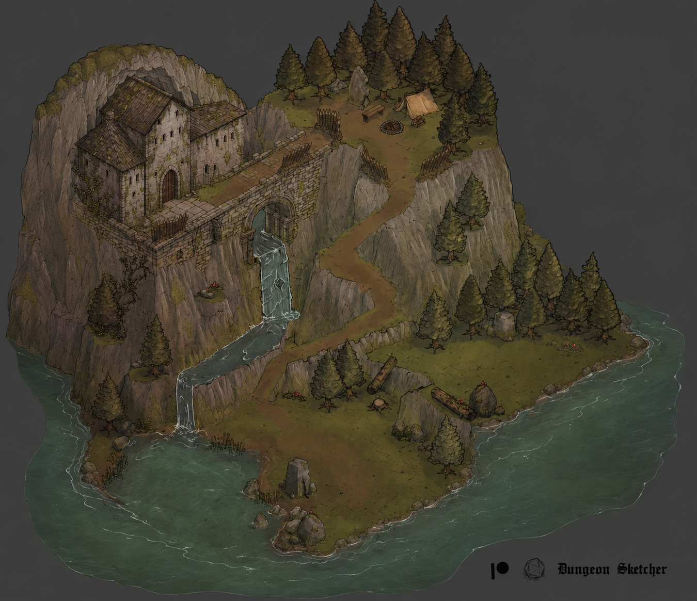
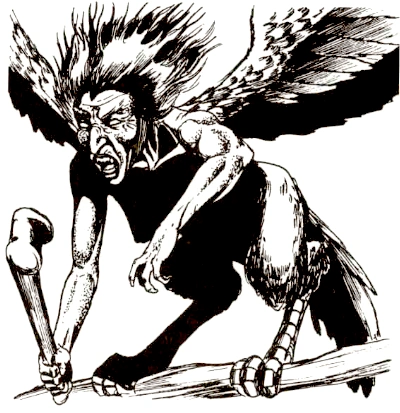

# Session Note

Quick Read

## Executive Summary

The party explored the approach to [[location-quasqueton|Quasqueton]], found edible berries and mushrooms, and learned from a fox that winged hunters threatened the lakeside. A song drew Sab up the trail until Grond restrained her. Two harpies attacked; Sab killed one and Orlin shot down the other. At the abandoned upper camp Sab recovered a collapsible fishing pole and a small jar of hardened salt. The party entered the stronghold through its partly open outer doors, heard a disembodied voice demand their names, and found a skeleton pinned to an inner door over writing in blood that appears to be Orcish. They opened a defensible guardroom and chose to camp there. Play ended before the rest was completed.

[Jump to the detailed record →](#what-happened)

## What Happened

At the cold green lake, Sab identified tart, filling red berries and Oogie recognized edible mushrooms with possible medicinal use. Gradrick noticed an unusual break in the waterfall spray and suggested there might be a hollow behind it; no one investigated. Grond saw movement in the water but could not identify it. A fox appeared along the trail. Orlin focused with the [[item-wooden-tongue-carving|Tongue of the Beast]] and spoke with it; the fox said it avoided the lakeside fish because of “winged ones.”

As the group climbed, Sab heard a woman's haunting song from above and was drawn uphill. Oogie's omen showed possible winged, singing humanoids above and a wet, web-filled route below. He warned the others. Gradrick cast a moving fog cloud around the rear of the party. Grond resisted the song and tackled Sab, breaking its hold. Orlin plugged his ears before rounding the bend and resisted it as well.

Two harpies flew down from the upper structure. Sab blinded one; Grond struck it with an arrow, and Sab killed it with her longsword after it crashed to the ground. Orlin and Grond shot the second; Orlin's final arrow killed it. The song continued from the stronghold afterward, so the party knew at least one singer remained unseen. Gradrick's failed attempt to maintain Eye Bite caused a magical mishap that turned him into a newt for three rounds; Sab later carried him toward the entrance. Sab cast Protection from Evil on Oogie, and Oogie supported Grond with Rage and restored luck.

At an old, weathered camp near the entrance, Sab searched ruined bags and took a collapsible fishing pole. She also found a small lidded clay jar of salt hardened by damp and took it. The group decided to seek cover inside rather than spend the night exposed to the remaining singer.

Quasqueton's monumental outer doors stood partly open. An old portcullis had left grooves and broken, rusted teeth at the threshold. Grond quietly forced the next swollen door. Sab went through invisibly, and a voice from no clear source boomed, “Intruders, speak your name as you enter the house of Rogahn and Zelligar.” Sab announced herself as Odin's daughter and claimed to be a new owner while holding up the [[item-writ-of-hollow-gate|Hollow Gate writ]]; there was no reply. A skeleton was pinned by a crude sword to another door. Once Orlin moved it, the group saw writing in blood behind it. Gradrick recognized the script as likely Orcish, but no one could read the message. Sab found no trap in the opposing wall or floor.

Grond opened the next door to a circular watch room with arrow slits overlooking the bridge and trail, followed by a smaller guardroom with shutters and rusted counterweight mechanisms. The party chose the smaller room as a defensible campsite, closed the doors behind them, and left the shutters alone. The session stopped as they prepared to keep watch; no long rest or recovery was resolved.

## Key Scenes / Beats

- The fox warned Orlin about winged hunters; the waterfall spray suggested an unexamined opening.
- Sab was briefly compelled by song and freed when Grond restrained her.
- The party killed two attacking harpies; at least one singer remained audible and unseen.
- Sab recovered a collapsible fishing pole and damp-hardened salt from the old camp.
- A disembodied entrance voice demanded names, but did not answer Sab's declaration of ownership.
- The party found unread Orcish writing in blood behind a pinned skeleton and settled in a guardroom without completing a rest.

## PCs In Play

- **[[pc-sab|Sab]]** — Identified the berries, escaped the song when Grond restrained her, blinded and killed a harpy, protected Oogie, collected the fishing pole and salt, and entered first while invisible. Active in the guardroom; priest; confidence high.
- **[[pc-oogie|Oogie]]** — Identified edible mushrooms, foresaw the upper harpy threat and lower web-filled possibility, warned the party, and supported Grond with Rage and luck. Active in the guardroom; seer; confidence high.
- **[[pc-gradrick|Gradrick]]** — Noticed the waterfall-spray anomaly, cast fog, and became a newt for three rounds after a spell mishap. Sab carried him toward the entrance; he returned to his normal form before play ended. Witch; confidence high.
- **[[pc-grond|Grond]]** — Resisted the song, restrained Sab, wounded both attacking harpies with arrows, and quietly forced swollen doors. Active in the guardroom; kobold pit fighter; confidence high.
- **[[pc-orlin|Orlin]]** — Spoke with the fox using the Tongue of the Beast, resisted the song with plugged ears, and killed the second harpy with his bow. Active in the guardroom; shapeshifter/beastmaster; confidence high.

Dern did not participate. Katherine Guy remains part of the expedition, though no action or exact position was described for her during Session 18.

## NPCs Encountered

- **Fox** — A normal fox near the trail told Orlin that winged creatures made fishing at the lake dangerous. Its identity and later whereabouts are unimportant; confidence high.
- **Unseen speaker** — A booming voice at the inner threshold demanded entrants' names in the house of Rogahn and Zelligar. Its source and nature are unknown; confidence high for the voice, low for any inferred identity.
- **[[npc-katherine-guy|Katherine Guy]]** — Remains with the expedition. She had no described action during this session; confidence high for continued membership, low for her exact position during the scenes.

## Locations Visited

- **[[location-quasqueton|Quasqueton]]** — Lake approach, ascending trail, abandoned camp, entrance passage, watch room, and adjoining guardroom. The group entered the stronghold and stopped in the guardroom.
- **Waterfall** — An unusual gap in its spray suggested a possible opening, unexamined.

## Factions in Play

No faction took a new, established action. Rogahn and Zelligar were named by the entrance voice; the party did not meet them or prove any current authority at the site.

## What the Players Learned

- Winged, singing creatures inhabit or watch the upper stronghold; two attacked and were killed, while at least one other singer was heard.
- The approach has edible berries and mushrooms, an old camp, and a possible opening behind the waterfall.
- The entrance still has a functioning voice or speaker that challenges intruders by name.
- The first watch rooms overlook the bridge and trail; the inner guardroom has closable shutters, though the party did not operate the rusted mechanism.
- Writing in blood behind a skeleton appears to be Orcish. Its contents remain unread.

## Possible / Unconfirmed Information

- Oogie's omen showed a wet, web-filled downward possibility, not a location the party visited or confirmed.
- The break in waterfall spray may mark a hollow, but no entrance was verified.
- The singer heard after combat was not seen; its number, position, and intentions remain unknown.
- The voice's source, whether it understood Sab's declaration, and any legal force of the party's papers remain unknown.
- The salt's usefulness and the mushrooms' medicinal property were not tested.

## Loot / Artifacts / Rewards

- Sab took one collapsible fishing pole from the abandoned camp.
- Sab took one small jar containing damp-hardened salt.
- No treasure, gold, or experience award was established during live play.

## Encounters / Combat Outcomes

- Sab was briefly compelled by song; Grond physically stopped her and ended the effect.
- Two harpies attacked. Sab killed the blinded one with a sword; Orlin killed the other with a bow after both he and Grond hit it. No PC injury was established.
- Gradrick became a newt for three rounds after a spell mishap. Sab carried him toward the entrance; he returned to normal before play ended.

## Open Threads / Unresolved Hooks

- Find the source of the continuing song and determine whether more harpies occupy Quasqueton.
- Read the Orcish blood message and learn who pinned the skeleton to the door.
- Determine the nature of the disembodied entrance voice and whether the papers support any ownership claim.
- Examine the possible waterfall hollow and the areas beyond the first guardrooms if the party chooses.
- Complete the guardroom rest and continue the stronghold exploration.

## Party Intent / Likely Next Steps

The party chose the guardroom for cover, closed the doors, and intended to rest under watch before exploring farther. That rest was not played to completion.
